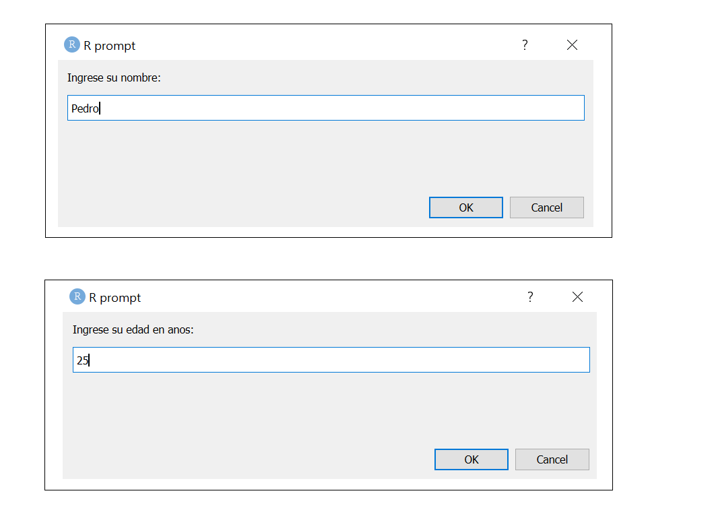
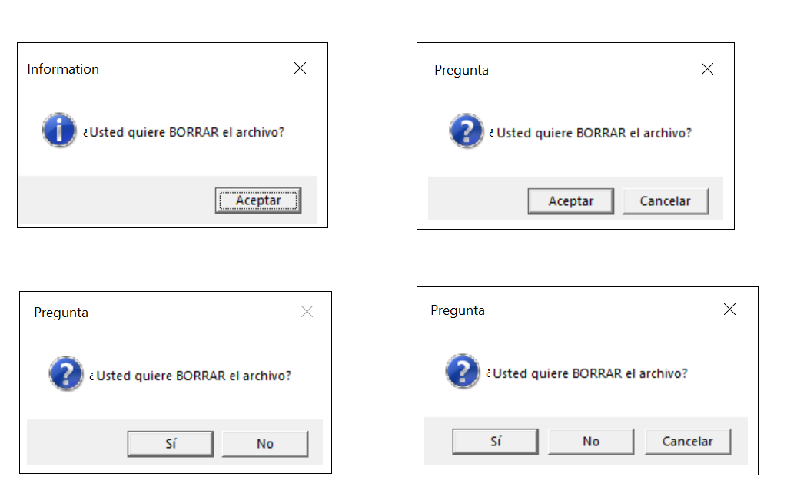

# Ingresando datos a R 

En este capítulo se muestra como ingresar datos a R.

## Usando la consola

La función `readline` básica de R sirve para escribir un mensaje en la consola y solicitar al usuario una información que luego se puede utilizar para realizar alguna operación.

Abajo se muestra un código de R que el lector puede copiar y pegar en un script. <font color="Fuchsia">El código se debe ejecutar línea por línea y no en bloque</font>.

La primera línea solicita el nombre del usuario y lo almacena automáticamente en la variable `my_name`. La segunda línea solicita la edad y la almacena en la variable `my_age`. La tercera se asegura que la edad se convierta a un número entero. La cuarta instrucción, escrita en varias líneas, saluda y entrega la edad del usuario en el próximo año.

```{r eval=FALSE}
my_name <- readline(prompt="Ingrese su nombre: ")
my_age  <- readline(prompt="Ingrese su edad en años: ")
my_age  <- as.integer(my_age) # convert character into integer

print(paste("Hola,", my_name, 
            "el año siguiente usted tendra", 
            my_age + 1, 
            "años de edad."))
```


## Usando ventana emergente con __svDialogs__

El paquete __svDialogs__ se puede utilizar para crear ventanas emergentes con un mensaje y solicitando información que luego se puede utilizar para realizar alguna operación.

Abajo se muestra un código de R que el lector puede copiar y pegar en un script. <font color="Fuchsia">El código se puede ejecutar en bloque</font>.

Este ejemplo hace lo mismo que el ejemplo anterior pero con la ventaja de abrir una ventana emergente para mostrar un mensaje y solicitar alguna información. Lo primero que se debe hacer es cargar el paquete __svDialogs__, si aún no lo ha instalado puede hacer escribiendo 

```{r eval=FALSE}
install.packages("svDialogs") # Para instalar el paquete
library(svDialogs)            # Para usar el paquete

my_name <- dlgInput(message="Ingrese su nombre: ")$res
my_age  <- dlgInput(message="Ingrese su edad en años: ")$res
my_age  <- as.integer(my_age) # convert character into integer

print(paste("Hola,", my_name, 
            "el año siguiente usted tendá", 
            my_age + 1, 
            "años de edad."))
```

En la siguiente figura se muestran las cajas solicitando la información.

<p align="center">
  
</p>

Abajo la salida luego de correr todo el código del ejemplo.

```{r echo=FALSE}
print("Hola, Pedro el año siguiente usted tendr 26 años de edad.")
```

## Botones para responder
La función `winDialog` del paquete básico __utils_ sirve para crear botones de diálogo en Windows solamente. A continuación se muestra la forma de generar los 4 tipos de botones.

```{r eval=FALSE}
library(utils)

winDialog(type="ok", message="¿Usted quiere BORRAR el archivo?")
winDialog(type="okcancel", message="¿Usted quiere BORRAR el archivo?")
winDialog(type="yesno", message="¿Usted quiere BORRAR el archivo?")
winDialog(type="yesnocancel", message="¿Usted quiere BORRAR el archivo?")
```

En la siguiente figura están las imágenes de los 4 tipos de botones.

<p align="center">
  
</p>

A continuación se muestra un ejemplo de cómo usar un botón para preguntar y luego imprimir en la consola un mensaje dependiendo de la respuesta. Copie todo el siguiente código en la consola y vea el resultado.

```{r eval=FALSE}
answer <- winDialog(type="yesno", mess="¿Le sirvió mi sugerencia?")
if (answer=='YES') {print('Excelente!')} else {print('Lástima')}
```


