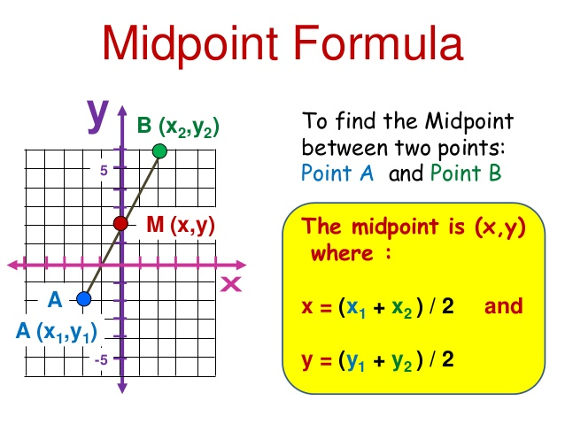

# Creación de funciones en \proglang{R}

En este capítulo se explica cómo crear funciones en \proglang{R} para realizar tareas específicas.

## Función en \proglang{R} \index{función}
Una función es un conjunto de instrucciones que convierten las entradas (_inputs_) en resultados (_outputs_) deseados. En la Figura \@ref(fig:machine2) se muestra una ilustración de lo que es una función o máquina general.

```{r machine2, echo=F, fig.cap='Ilustración de una función, tomada de www.mathinsight.org.', dpi=10, fig.align='center'}
knitr::include_graphics("images/function_machine.png")
```

## Partes de una función en \proglang{R} \index{partes de función}
Las partes de una función son:

- Entradas: o llamadas también __argumentos__, sirven para ingresar información necesaria para realizar el procedimiento de la función. Los argumentos pueden estar vacíos y a la espera de que el usuario ingrese valores, o pueden tener valores por defecto, esto significa que si el usuario no ingresa una valor al función usará el valor por defecto. Una función puede tener o no argumentos de entrada, en los ejemplos se mostrarán estos casos.
- Cuerpo: el cuerpo de la función está formado por un conjunto de instrucciones que transforman las entradas en las salidas deseadas. Si el cuerpo de la función está formado por varias instrucciones éstas deben ir entre llaves.
- Salidas: son los resultados de la función. Toda función debe tener al menos un resultado, si una función no genera un resultado entonces no sirve para nada. Si una función entrega varios tipos de objetos se acostumbra a organizarlos en una lista que puede manejar los diferentes tipos de objetos.

```{r, eval=FALSE}
nombre_de_funcion <- function(par1, par2, ...) {
  cuerpo
  cuerpo
  cuerpo
  cuerpo
  return(resultado)
}
```


A continuación se mostrarán varios ejemplos __sencillos__ para que el lector aprenda a construir funciones.

### Ejemplo {-}
Construir una función que reciba dos números y que entregue la suma de estos números.

Lo primero es elegir un nombre apropiado para la función, aquí se usó el nombre `suma` porque así se tiene una idea clara de lo que hace la función. La función suma recibe dos parámetros, `x` representa el primer valor ingresado mientras que `y` representa el segundo. El cuerpo de la función está formado por dos líneas, en la primera se crea el objeto `resultado` en el cual se almanacena el valor de la suma, en la segunda línea se le indica a \proglang{R} que queremos que retorne el valor de la suma almacenada en el objeto `resultado`. A continuación se muestra el código para crear la función solicitada.

```{r}
suma <- function(x, y) {
  resultado <- x + y
  return(resultado)
}
```

Para usar la función creada sólo se debe ejecutar, vamos a obtener la suma de los valores 4 y 6 usando la función `suma`, a continuación el código necesario.

```{r}
suma(x=4, y=6)
```

Para funciones simples como la anterior es posible escribirlas en forma más compacta. Es posible reducir el cuerpo de la función de 2 líneas a sólo una línea solicitándole a \proglang{R} que retorne directamente la suma sin almacenarla en ningún objeto. A continuación la función `suma` modificada.

```{r}
suma <- function(x, y) {
  return(x + y)
}

suma(x=4, y=6)  # Probando la función
```

Debido a que la función `suma` tiene un cuerpo muy reducido es posible escribirla en forma más compacta, en una sola línea. A continuación se muestra el código para reescribir la función.

```{r}
suma <- function(x, y) x + y

suma(x=4, y=6)  # Probando la función
```

### Ejemplo {-}
Construir una función que genere números aleatorios entre cero y uno hasta que la suma de éstos números supere por primera vez el valor de 3. La función debe entregar la cantidad de números aleatorios generados para que se cumpla la condición.

Vamos a llamar la función solicitada con el nombre `fun1`, esta función __NO__ necesita ningún parámetro de entrada. El valor de 3 que está en la condición puede ir dentro del cuerpo y por eso no se necesitan parámetros para esta función. En el cuerpo de la función se genera un vector con un número aleatorio y luego se chequea si la suma de sus elementos es menor de 3, si se cumple que la suma es menor que 3 se siguen generando números que se almacenan en el vector `num`. Una vez que la suma exceda el valor de 3 NO se ingresa al `while` y se pide la longitud del vector o el valor de `veces` solicitado. A continuación el código de la función.

```{r}
fun1 <- function() {
  num <- runif(1)
  veces <- 1
  while (sum(num) < 3) {
    veces <- veces + 1
    num[veces] <- runif(1)
  }
  return(veces)
}

fun1()  # primera prueba
```

### Ejemplo {-}
Construir una función que, dado un número entero positivo (cota) ingresado por el usuario, genere números aleatorios entre cero y uno hasta que la suma de los números generados exceda por primera vez la cota. La función debe entregar un vector con los números aleatorios, la suma y la cantidad de números aleatorios. Si el usuario no ingresa el valor de la cota, se debe asumir igual a 1.

La función aquí solicitada es similar a la construída en el ejemplo anterior. La función `fun2` tiene un sólo parámetro con el valor por defecto, si el usuario no ingresa valor a este parámetro, se asumirá el valor de uno. El cuerpo de la función es similar al anterior. Como la función debe entregar un vector y dos números, se construye la lista `resultado` que almacena los tres objetos solicitados. A continuación el código para función solicitada.

```{r}
fun2 <- function(cota=1) {
  num <- runif(1)
  while (sum(num) < cota) {
    num <- c(num, runif(1))
  }
  resultado <- list(vector=num,
                    suma=sum(num),
                    cantidad=length(num))
  return(resultado)
}
```

Probando la función con cota de uno.

```{r}
fun2()
```

Probando la función con cota de tres.

```{r}
fun2(cota=3)
```

### Ejemplo {-} 
Construya una función que reciba dos números de la recta real y que entregue el punto médio de estos números. El resultado debe ser un mensaje por pantalla.

El punto médio entre dos valores es la suma de los números divido entre dos. La función `cat` sirve para concatenar objetos y presentarlos por pantalla. A continuación el código para la función requerida.

```{r}
medio <- function(a, b) {
  medio <- (a + b) / 2
  cat("El punto medio de los valores",
      a, "y", b,
      "ingresados es", medio)
}

medio(a=-3, b=-1)  # Probando la función
```

```{block2, type='rmdnote'}
La función `cat` es muy útil para presentar resultados por pantalla. Consulte la ayuda de la función para ver otros ejemplos.
```

## EJERCICIOS {-}
Construir funciones en \proglang{R} que realicen lo solicitado.

1. Construya una función que reciba dos números reales `a` y `b`, la función debe decir cuál es el mayor de ellos.

2. Escriba una función llamada `media` que calcule la media muestral de un vector numérico `x` ingresado a la función. A continuación la fórmula para calcular la media muestral.

$$\bar{x}=\frac{\sum_{i=1}^n x_i}{n}$$

Nota: no puede usar la función `mean( )`.

3. Construya una función que encuentre las raíces de una ecuación de segundo grado. El usuario debe suministrar los coeficientes `a`, `b` y `c` de la ecuación $ax^2+bx+c=0$ y la función debe entregar las raíces.  

4. Escribir una función que calcule la velocidad de un proyectil dado que el usuario ingresa la distancia recorrida en Km y el tiempo necesario en minutos. Expresar el resultado se debe entregar en metros/segundo, recuerde que

$$velocidad = \frac{espacio}{tiempo}$$

5. Construya una función que calcule las coordenadas del punto medio $M$ entre dos puntos $A$ y $B$. Vea la Figura \@ref(fig:midpoint) para una ilustración. ¿Cuáles cree usted que deben ser los parámetros de entrada de la función?

```{r midpoint, echo=F, fig.cap='Ilustración del punto medio entre dos puntos, tomada de https://www.slideshare.net/bigpassy/midpoint-between-two-points', dpi=600, fig.align='center'}

```

6. Escribir una función que reciba dos valores $a$ y $b$ y que los intercambie. Es decir, si ingresa $a=4$ y $b=9$ que la función entregue $a=9$ y $b=4$.

7. Construya una función a la cual le ingrese el salario por hora y el número de horas trabajadas durante una semana por un trabajador. La función debe calcular el salario neto.


