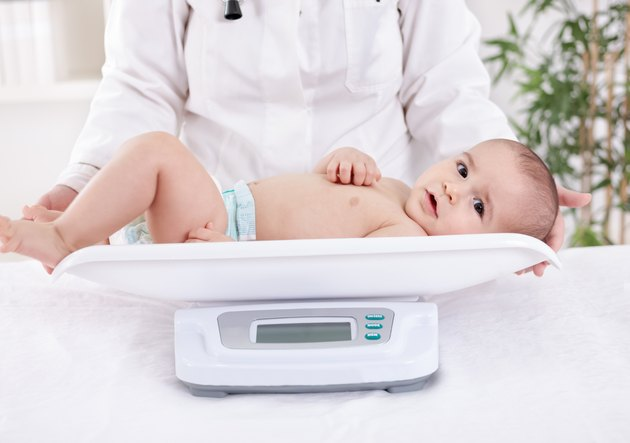

# Estadística descriptiva con dplyr

En este capítulo se mostrará como usar el paquete dplyr de R para hacer un análisis descriptivo usando una base de datos real.

<p align="center">
  
</p>

Las variables de la base de datos que vamos a utilizar en el ejemplo se muestran a continuación.

- bwt: Peso del bebé al nacer, redondeado a la **onza** más cercana.
- gestación: Duración del embarazo en **días**, calculado a partir del primer día del último período menstrual normal.
- paridad: Indicador de si el bebé es el primogénito o desconocido.
- edad: edad de la madre en el momento de la concepción, en **años**.
- altura: Altura de la madre, en **pulgadas**.
- peso: peso de la madre antes del embarazo, en **libras**.
- fumar: estado de tabaquismo Indicador de si la madre fuma o no.

Las unidades de algunas de las variables están en sistema inglés, más adelante mostraremos cómo convertir esas variables.

Para leer la base de datos usamos el siguiente código.

```{r}
url <- 'https://tinyurl.com/ya9fvteb'
dt <- read.table(url, header=TRUE, sep='\t')
```

Par ver el encabezado de la base de datos.

```{r}
head(dt, n=8)
```

Ahora vamos a explorar la base de datos por medio de la función `summary`.

```{r}
summary(dt)
```

Otra tabla de resumen se puede obtener con la función `str`.

```{r}
str(dt)
```

Para conocer la imension de la base de datos usamos la función `dim`.

```{r}
dim(dt)
```

Para ver el peso de las madres.

```{r}
dt$weight
```

Otra forma de ver el peso almacenado en columna 6.

```{r}
dt[, 6]
```

Para ver la información de las madres 2, 125, 569 y 830 podemos usar el siguiente código:

```{r}
dt[c(2, 125, 569, 830), ]
```

Para ver la edad y smoke de las mujeres 40, 58, 69 y 256 podemos usar el siguiente código:

```{r}
dt[c(40, 58, 69, 256), c('age', 'smoke')]
```

## Medidas de tendencia central, variabilidad, posición y correlación

En esta sección vamos a mostrar como se pueden obtener algunas medidas de resumen para los datos usando funciones básicas de R como son:

- `mean(x, trim=0, na.rm=FALSE)`: para calcular el promedio.
- `var(x, na.rm=FALSE)`: para calcular la varianza **muestral**.
- `sd(x, na.rm=FALSE)`: para calcular la desviación estándar **muestral**.
- `quantile(x, probs, na.rm=FALSE)`: para calcular cuantiles.
- `min(x, na.rm=FALSE)`: para calcular el mínimo.
- `max(x, na.rm=FALSE)`: para calcular el máximo.

¿Cuál es el peso promedio de las madres?

```{r}
mean(dt$weight)
```

El resultado de `NA` se debe a los NA's presentes en la base de datos. Para remover los NA's podemos proceder de la siguiente manera:

```{r}
mean(dt$weight, na.rm=TRUE)
```

Vamos ahora a averiguar características de resumen para el peso de los bebés.

<p align="center">
  
</p>

¿Cual es el peso promedio de los bebés?

```{r}
mean(dt$bwt)
```

¿Cual es la varianza del peso de los bebés?

```{r}
var(dt$bwt)
```

¿Cual es la desviación del peso de los bebés?

```{r}
sd(dt$bwt)
```

¿Cuales son Q1, D4 y P90 para el peso de los bebés?

```{r}
quantile(dt$bwt, probs=c(0.25, 0.40, 0.90))
```

## Paquete dplyr

El paquete **dplyr** es un paquete que se usa para manejar bases de datos. [En este enlace](https://cran.r-project.org/web/packages/dplyr/index.html) puede consultar la ayuda del paquete y ver la viñetas con ejemplos de las funciones del paquete.

El paquete **dplyr** hace parte de un ecosistema llamado **tidyverse**, el cual es un conjunto de paquetes complementarios utilizados para hacer análisis de datos.

A continuación una figura con algunos de los paquetes de **tidyverse**.

<p align="center">
  
</p>

A continuación se muestra el hexalogo del paquete **dplyr** que vamos a utilizar en esta publicación.

<p align="center">
  
</p>

Para usar el paquete **dplyr** podemos cargar a **tidyverse** o directamente a **dplyr** así:

```{r}
library(dplyr)
```

En el mensaje anterior se aclara que hay unas funciones de **dplyr** que enmarcaran otras funciones de los paquetes **stats** y **base**.

## Pipes en R

En R se tienen dos tipos de operadores pipe:

- `%>%` del paquete **magrittr**.
- `|>` nativo y pertenece a la base de R.

Los operadores pipe sirve para escribir instrucciones de manera secuencial. A continuación vamos a mostrar dos ejemplos de la misma operación usando ambos pipe. 

El objetivo es tomar la base de datos `dt`, extraer la variable `bwt` y al vector o variable resultante calcularle la media con `mean`.

```{r}
dt %>% pull(bwt) %>% mean  # Usando pipe de magrittr
dt |> pull(bwt) |> mean()  # Usando pipe nativo
```

De la salida anterior vemos que los resultados son idénticos. 

Para ver una comparación de los dos pipe se recomienda ver el siguiente video.

<iframe width="560" height="315" src="https://www.youtube.com/embed/TmSwDAvPX2Q?si=wwqJ-0nPdwLJUyPB" title="YouTube video player" frameborder="0" allow="accelerometer; autoplay; clipboard-write; encrypted-media; gyroscope; picture-in-picture; web-share" allowfullscreen></iframe>

## Estadística descriptiva con dplyr

La función `glimpse` del paquete **dplyr** nos da un resumen de las variables de la base de datos.

```{r}
glimpse(dt)
```

Vamos a extraer una sola variable con `pull` y luego a calcular la media, varianza y desviación estándar del peso de los bebés.

```{r}
dt |> pull(bwt) |> mean()
dt |> pull(bwt) |> var()
dt |> pull(bwt) |> sd()
dt |> pull(bwt) |> quantile(probs=c(0.25, 0.40, 0.90))
```

Vamos a calcular las mismas medidas de resumen anteriores pero con escritura secuencial usando el operador pipe `|>` y la función `summarise`.

```{r}
dt |> summarise(media_peso = mean(bwt),
                varianza_peso = var(bwt),
                desvi_peso = sd(bwt),
                Q1 = quantile(bwt, probs=0.25),
                D4 = quantile(bwt, probs=0.40),
                P90 = quantile(bwt, probs=0.90))
```

Vamos a ver cómo cambian las medidas anteriores cuando diferenciamos por el tipo de embarazo.

```{r}
dt |> group_by(parity) |> 
  summarise(media_peso = mean(bwt),
            varianza_peso = var(bwt),
            desvi_peso = sd(bwt),
            Q1 = quantile(bwt, probs=0.25),
            D4 = quantile(bwt, probs=0.40),
            P90 = quantile(bwt, probs=0.90),
            n = n())
```

Vamos a ver como cambiar las medidas anteriores cuando diferenciamos por fumar.

```{r}
dt |> group_by(smoke) |> 
  summarise(media_peso = mean(bwt),
            varianza_peso = var(bwt),
            desvi_peso = sd(bwt),
            Q1 = quantile(bwt, probs=0.25),
            D4 = quantile(bwt, probs=0.40),
            P90 = quantile(bwt, probs=0.90),
            n = n())
```

Vamos a ver como cambiar las medidas anteriores cuando diferenciamos por el tipo de embarazo y fumar.

```{r}
dt |> group_by(parity, smoke) |> 
  summarise(media_peso = mean(bwt),
            varianza_peso = var(bwt),
            desvi_peso = sd(bwt),
            Q1 = quantile(bwt, probs=0.25),
            D4 = quantile(bwt, probs=0.40),
            P90 =quantile(bwt, probs=0.90),
            n = n())
```

Calculando la correlación entre peso bebe y peso madre.

```{r}
dt |> select(bwt, weight) |> cor()
```

Como hay NA en alguna de las variables vamos a agregar `use='complete.obs'` para obtener la correlación.

```{r}
dt |> select(bwt, weight) |> cor(use='complete.obs')
```

De la salida anterior vemos que la correlación lineal de Pearson entre ambas variables es 0.1541.

## Creando nuevas variables

En esta sección vamos a mostrar cómo crear nuevas variables a partir de variables ya existentes en la base de datos.

Vamos a transformar la altura y el peso de la madre al [sistema internacional de unidades](https://es.wikipedia.org/wiki/Sistema_Internacional_de_Unidades).

```{r}
dt |> mutate(height_mt = height * 0.0254,
             weight_kg = weight * 0.453592) -> dt

head(dt, n=4)
```

Ahora vamos a calcular el IMC con las nuevas variables así:

```{r}
dt |> mutate(imc = weight_kg / height_mt^2) -> dt

dt |> head(n=4)
```

De la salida anterior vemos la nueva base de datos con las tres nuevas variables creadas con `mutate`.

## Tablas de frecuencia

Vamos a una la variable de clasificación según peso. Recien nacidos con pesos inferiores a 100 onzas son considerados livianos, aquellos con pesos entre 100 (inclusive) y 140 son aceptables y con pesos de 140 o más se consideran sanos. 

```{r}
dt |> mutate(clasi = cut(bwt, 
                         breaks=c(-Inf, 100, 140, Inf),
                         labels=c("Liviano","Aceptable","Sano"),
                         include.lowest = TRUE)) -> dt
```

Tabla de frecuencia absoluta para clasificación.

```{r}
dt |> pull(clasi) |> 
  table()
```

Tabla de frecuencia relativa para clasificación.

```{r}
dt |> pull(clasi) |> 
  table() |> 
  prop.table() |> 
  round(digits=4)
```

Tabla de frecuencia absoluta para fumar y clasificación.

```{r}
dt |> select(smoke, clasi) |> 
  table() |> 
  addmargins()
```

Tabla de frecuencia relativa para fumar y clasificación.

```{r}
dt |> select(smoke, clasi) |> 
  table() |> 
  prop.table()
```

Tabla de frecuencia relativa por __columnas__ para fumar y clasificación.

```{r}
dt |> select(smoke, clasi) |> 
  table() |> 
  prop.table(margin=2)
```

## Gráficos

En esta sección se mostrará como crear algunos gráficos básicos. Para más detalles de como construir otros gráficos se recomienda consultar el libro [Gráficos con R](https://fhernanb.github.io/Graficos-con-R/).

Boxplot para el peso de los bebés.

```{r analDescrip01, fig.cap='Boxplot para el peso de los bebés.', fig.asp=0.6, fig.width=10}
boxplot(dt$bwt, las=1, col="darkorchid1", 
        ylab="Peso del bebe (onzas)")
```

Boxplot horizontal para el peso de los bebés.

```{r analDescrip02, fig.cap='Boxplot horizontal para el peso de los bebés.', fig.asp=0.6, fig.width=10}
boxplot(dt$bwt, las=1, col="darkseagreen2",
        horizontal=TRUE,
        xlab="Peso del bebe (onzas)")
```

Boxplot para el peso de los bebés diferenciando por la variable smoke.

```{r analDescrip03, fig.cap='Boxplot para el peso diferenciando por fumar.', fig.asp=0.6, fig.width=10}
boxplot(dt$bwt ~ dt$smoke, las=1)
```

Editando el boxplot para obtener una mejor apariencia.

```{r analDescrip04, fig.cap='Boxplot mejorado para el peso diferenciando por fumar.', fig.asp=0.6, fig.width=10}
boxplot(dt$bwt ~ dt$smoke, las=1, 
        col=c("dodgerblue", "hotpink2"),
        main='Babies weight given smoke status',
        xlab='Does the mother smoke?',
        ylab='Weight (ounces)')
```

¿Como cambiar Not y Yes de smoke para colocar el gráfico en español?

```{r}
dt$fuma <- ifelse(dt$smoke == 'Not', 'No', 'Si')
```

Boxplot en español

```{r analDescrip05, fig.cap='Boxplot para el peso de los bebés en español.', fig.asp=0.6, fig.width=10}
boxplot(dt$bwt ~ dt$fuma, las=1,
        xlab='¿Fuma la madre?',
        ylab='Peso del bebe (onzas)', las=1)
```

¿Cual es la relación entre peso del bebe y de la madre?

```{r analDescrip06, fig.cap='Diagrama de dispersión para peso del bebé versus peso de la madre.', fig.asp=0.6, fig.width=10}
plot(x=dt$weight, y=dt$bwt,
     xlab='Peso de la madre (libras)',
     ylab='Peso del bebe (onzas)', las=1)
```

Diagrama de dispersión entre pesos diferenciando por fumar

```{r analDescrip07, fig.cap='Diagrama de dispersión para peso del bebé versus peso de la madre diferenciando por fumar.', fig.asp=0.6, fig.width=10}
dt2 <- na.omit(dt)

plot(x=dt2$weight, y=dt2$bwt, pch=20, las=1,
     xlab='Peso de la madre (libras)',
     ylab='Peso del bebe (onzas)',
     col=as.factor(dt2$smoke))

legend('bottomright', legend=c('No', 'Si'),
       pch=20, col=1:2)
```

Para ver la relación entre el peso de la madre y la edad de la madre.

```{r analDescrip08, fig.cap='Diagrama de dispersión del peso de la madre versus su edad.', fig.asp=0.6, fig.width=10}
plot(dt$age, dt$weight, pch=20, col="tomato", las=1,
     xlab="Edad de la madre",
     ylab="Peso de la madre")
```

