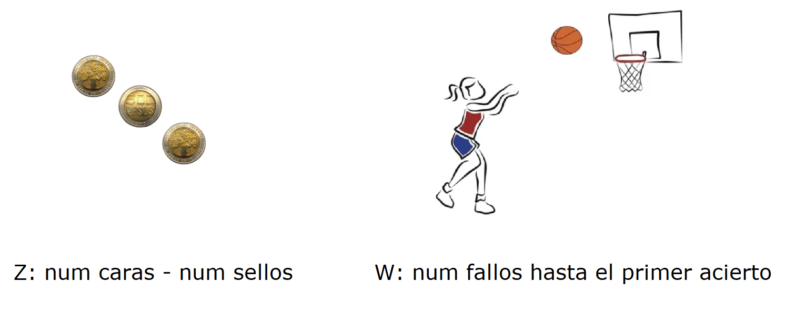
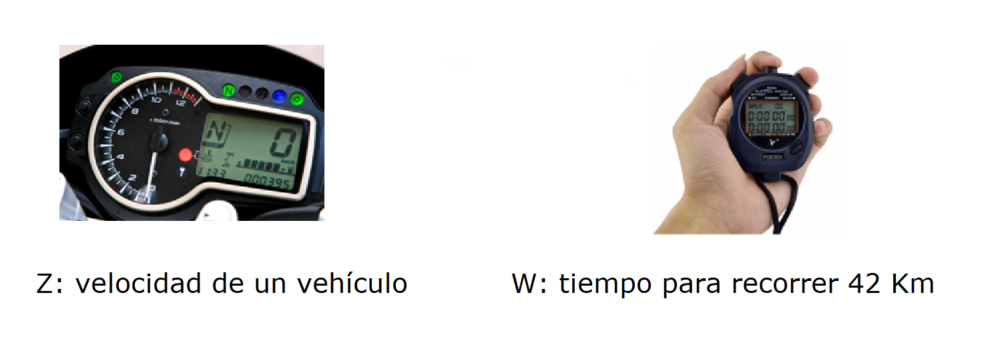

# Variables aleatorias

En este capítulo se mostrará como usar R para representar gráficamente variables aleatorias, calcular el valor esperado y obtener la varianza.

```{block2, type="rmdnote"}
Para un espacio muestral dado $S$ de algún experimento, una variable aleatoria es cualquier regla que asocia un número con cada resultado en $S$.
```

## Variable aleatoria discreta
Una variable aleatoria discreta $X$ definida en el espacio muestral $S$ puede tomar valores en un conjunto finito o en un conjunto infinito pero contable. A continuación se presentan dos ejemplos.

- Si se lanzan tres monedas y se define $Z$ como el número de caras menos el número de sellos, $Z$ puede tomar valores de -3, -1, 1 y 3.
- Si lanza un balón de baloncesto a un aro y se define $W$ como el número de lanzamientos fallidos antes de encestar la primera vez, $W$ puede tomar valores de 0, 1, 2, 3, ....

```{r ejemVarDis, echo=FALSE, fig.cap='Ejemplo de variables aleatorias discretas.', dpi=400, fig.align='center', out.width = '110%'}

```

Sea $X$ una variable aletoria discreta que toma valores en el conjunto $D$ y con función de masa de probabilidad $f(x)$. El valor esperado $X$ se define como

$$
E(X) = \mu = \sum_{i \in D} x_i \, f(x_i)
$$
La varianza de la variable aleatoria $X$ se define como 

$$
Var(X) = \sigma^2 = \sum_{i \in D} (x_i-\mu)^2 \, f(x_i)
$$

### Ejemplo {-}
Suponga que $f(x)$ representa la función de masa de probabilidad dada por 

$$
f(x) = \frac{2x+1}{25}, \quad x=0, 1, 2, 3, 4
$$

a) Dibujar $f(x)$.
b) Dibujar $F(x)$.
c) Calcular $E(X)$.
d) Calcular $Var(X)$.
e) Calcular $E(h(x))$ con $h(x)=3x^2+x$.

__Solución__

Lo primero que debemos hacer es construir la función $f(x)$.

```{r}
f <- function(x) {
  (2*x+1) / 25
}
```

Ahora vamos a verificar que es una función de masa de probabilidad, es decir, que los valores de $f(x)>0$ y que la suma de las probabilidades es 1.

```{r}
x_vals <- c(0, 1, 2, 3, 4)  # Vector con los valores de X
probs <- f(x_vals)          # Vector con P(X=x)=f(x)

cbind(x_vals, probs)        # Tabla de X y P(X=x)

sum(probs)                  # Debe sumar 1
```

De la tabla anterior vemos que $f(x) > 0$ y de la suma observamos que las probabilidades suman 1.

Vamos a dibujar la función de masa $f(x)$ así:

```{r funMasVarDis, fig.align='center', fig.cap='Función f(x) para el ejemplo.', fig.asp=0.9, fig.width=5, echo=TRUE}
plot(x=x_vals, y=probs, type="h",
     lwd=3, col="blue", las=1,
     xlab="X", ylab="f(X=x)")

grid()   # Para incluir una rejilla
```

Vamos a dibujar la función de masa $F(x)$. Lo primero que se debe hacer es calcular las probabilidades acumuladas hasta cada valor que pueda tomar $X$, para esto usamos la función `cumsum` aplicada al vector `probs`.

```{r}
probs_acumul <- cumsum(probs)  # Vector con F(X=x)
probs_acumul
```

Ahora si podemos dibujar $F(x)$ con la ayuda de la función `stepfun`.

```{r funAcumVarDis, fig.align='center', fig.cap='Función F(x) para el ejemplo.', fig.asp=0.9, fig.width=5, echo=TRUE}
# Para crear un objeto con la informacion para dibujar F(x)
F <- stepfun(x=x_vals, y=c(0, probs_acumul), right=TRUE)

# Para dibujar la funcion F(x)
plot(F, verticals=FALSE, 
     lwd=3, col="blue", las=1,
     xlab="X", ylab="F(X=x)", main="")

grid()   # Para incluir una rejilla
```

Para calcular $E(X)$ podemos usar el siguiente código.

```{r}
mu <- sum(x_vals * probs)
mu
```

Para calcular $Var(X)$ podemos usar el siguiente código.

```{r}
sigma2 <- sum((x_vals - mu)^2 * probs)
sigma2
```

Para calcular $E(h(x))$ con $h(x)=3x^2+x$ podemos usar el siguiente código.

```{r}
sum((3*x_vals^2 + x_vals) * probs)
```

## App shiny pmf
En el repositorio semilleroApps que está en [github](https://github.com/fhernanb/semilleroApps/tree/master) hay una aplicación llamada **pmf** que recibe un función de masa de probabilidad y ella entrega el dibujo de $f(x)$, $F(x)$, $E(X)$ y $Var(X)$. Para usar la aplicación usted debe copiar el siguiente código en la consola de R y esperar unos segundos para ejecutar la aplicación.

```{r eval=FALSE}
if (!require('shiny')) install.packages("shiny")
shiny::runGitHub(repo="semilleroApps", user="fhernanb", sub="pmf")
```


## Variable aleatoria continua
Una variable aleatoria continua $X$ definida en el espacio muestral $S$ se considera continua si ella puede tomar valores en los números reales $\Re$. A continuación se presentan dos ejemplos.

- Se observa un vehículo en movimiento y se define $Z$ como la velocidad al pasar por un punto.
- Se observa un grupo de personas corriendo una maratón y se define $W$ como el tiempo necesario para hacer el recorrido.

```{r ejemVarCont, echo=FALSE, fig.cap='Ejemplo de variables aleatorias continuas.', dpi=400, fig.align='center', out.width = '110%'}

```

Sea $X$ una variable aletoria continua que toma valores en el conjunto $D$ y con función de masa de densidad $f(x)$. El valor esperado $X$ se define como

$$
E(X) = \mu = \int_{x \in D} x_i \, f(x_i)
$$
La varianza de la variable aleatoria $X$ se define como 

$$
Var(X) = \sigma^2 = \int_{x \in D} (x_i-\mu)^2 \, f(x_i)
$$

### Ejemplo {-}
Suponga que $f(x)$ representa la función de masa de densidad dada por 

$$
f(x) = 20 e^{-20(x-12.5)}, \quad x>12.5
$$

a) Dibujar $f(x)$.
b) Dibujar $F(x)$.
c) Calcular $E(X)$.
d) Calcular $Var(X)$.
e) Calcular $E(h(x))$ con $h(x)=3x^2+x$.

__Solución__

Lo primero que debemos hacer es construir la función $f(x)$.

```{r}
f <- function(x) {
  20 * exp(-20*(x-12.5))
}
```

Ahora vamos a verificar que es una función de densidad de probabilidad, es decir, que el área bajo la curva es 1.

```{r}
integrate(f=f, lower=12.5, upper=Inf)                  # Debe sumar 1
```

Vamos a dibujar la función de densidad $f(x)$ así:

```{r funMasVarCont, fig.align='center', fig.cap='Función f(x) para el ejemplo 2.', fig.asp=0.9, fig.width=5, echo=TRUE}
curve(expr=f(x), from=12.5, to=13,
      lwd=3, col="blue", las=1,
      xlab="X", ylab="f(X=x)")
```

La función $F(x)$ la podemos obtener integrando la función $f(x)$ de forma computacional así:

```{r}
F <- function(x, a)  integrate(f=f, lower=a, upper=x)$value

F <- Vectorize(F) # Para vectorizar la función y que pueda usar vectores
```

Vamos a dibujar la función $F(x)$ así:

```{r funFVarCont, fig.align='center', fig.cap='Función F(x) para el ejemplo 2.', fig.asp=0.9, fig.width=5, echo=TRUE}
curve(expr=F(x, a=12.5), from=12.5, to=13,
      lwd=3, col="tomato", las=1,
      xlab="X", ylab="F(X=x)")
```

Para obtener $E(X)$ vamos a realizar lo siguiente:

```{r}
aux_fun <- function(x) x * f(x) # Función auxiliar para aplicar definición

integrate(f=aux_fun, lower=12.5, upper=Inf)
```

Para obtener $Var(X)$ vamos a realizar lo siguiente:

```{r}
aux_fun <- function(x) (x-12.55)^2 * f(x) # Función auxiliar para aplicar definición

integrate(f=aux_fun, lower=12.5, upper=Inf)
```

## App shiny pdf
En el repositorio semilleroApps que está en [github](https://github.com/fhernanb/semilleroApps/tree/master) hay una aplicación llamada **pdf** que recibe un función de densidad de probabilidad y ella entrega el dibujo de $f(x)$, $F(x)$, $E(X)$ y $Var(X)$. Para usar la aplicación usted debe copiar el siguiente código en la consola de R y esperar unos segundos para ejecutar la aplicación.

```{r eval=FALSE}
if (!require('shiny')) install.packages("shiny")
shiny::runGitHub(repo="semilleroApps", user="fhernanb", sub="pdf")
```

