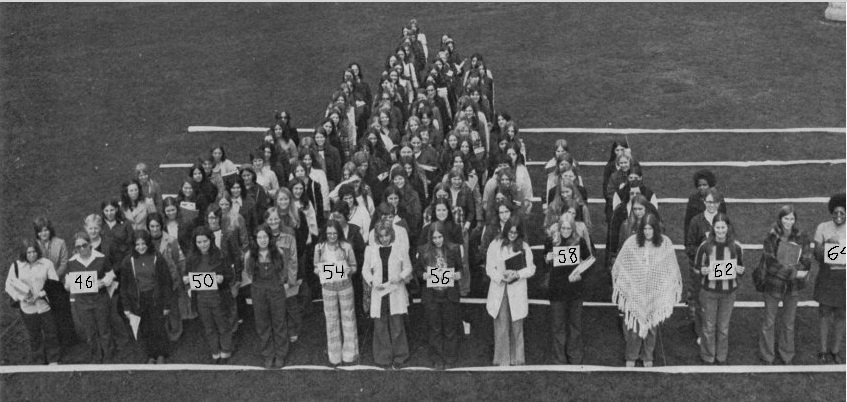
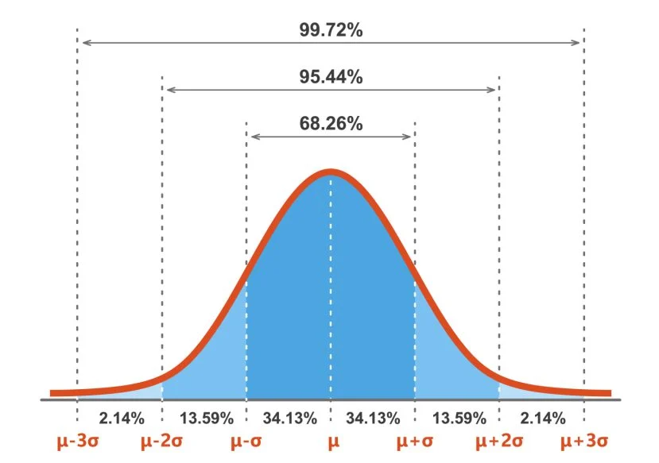
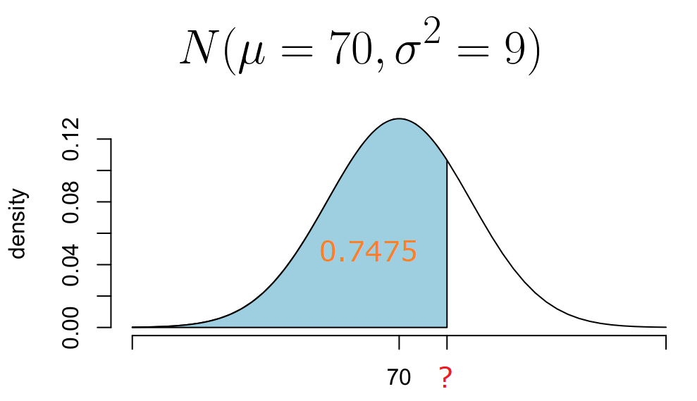

# Distribución normal {#normal}

En este capítulo se mostrará en detalle la distribución normal, la distribución más importante en estadística.

```{r personasnormal, echo=FALSE, fig.cap='Personas formando la normal con su estatura.', dpi=400, fig.align='center', out.width = '100%'}

```

A continuación un video donde se explica de manera sencilla la distribución normal.

<iframe width="560" height="315" src="https://www.youtube.com/embed/ga9md4GPFhE?si=Ow6JmnAQfLXNuWEL" title="YouTube video player" frameborder="0" allow="accelerometer; autoplay; clipboard-write; encrypted-media; gyroscope; picture-in-picture; web-share" allowfullscreen></iframe>

## Función de densidad

La distribución normal, también conocida como distribución gaussiana o curva de campana, es una de las distribuciones de probabilidad más importantes en estadística. Se caracteriza por ser simétrica y tiene una forma de campana. Su función de densidad de probabilidad se define mediante la siguiente ecuación:

\[
f(x | \mu, \sigma^2) = \frac{1}{\sigma \sqrt{2\pi}} e^{-\frac{1}{2} \left(\frac{x - \mu}{\sigma}\right)^2},
\]

donde:

- \(x\) es el valor de la variable aleatoria $X$.
- \(\mu\) es la media (promedio) de la distribución.
- \(\sigma\) es la desviación estándar, que mide la dispersión de los datos.

```{block2, type="rmdnote"}
Si una variable aleatoria $X$ se distribuye normal con media $\mu$ y varianza $\sigma^2$, esto se denota por $X \sim N(\mu, \sigma^2)$. El segundo elemento de la notación es la varianza, no la desviación estándar.
```

## Visualización de la distribución

Generemos un gráfico de la función de densidad de probabilidad de la distribución normal estándar.

```{r distnorm1, fig.cap='Ejemplo 1 de distribución normal.', fig.height=4, fig.width=6}
curve(dnorm(x, mean=0, sd=1), 
      from=-4, to=4, lwd=3, col="blue",
      main = "N(0, 1)", xlab = "X", ylab = "f(x)")
```

En el gráfico anterior, la curva azul representa la distribución normal estándar. Como se puede observar, tiene una forma de campana y es simétrica en torno a la media de 0.

```{r distnorm2, fig.cap='Ejemplo 2 de distribución normal.', fig.height=4, fig.width=6}
curve(dnorm(x, mean=1.65, sd=0.15), 
      from=0, to=4, lwd=3, col="tomato",
      main = "N(mu=1.65, sigma2=0.15^2)", 
      xlab = "X", ylab = "f(x)")
```

Vamos a comparar el efecto de la media y la desviación.

```{r norm3, fig.cap='Varias densidades normal.', fig.height=4, fig.width=6, echo=FALSE}
# Crear una secuencia de valores para el eje x
x <- seq(0, 5, length.out = 1000)

# Calcular las tres densidades de la distribución normal con diferentes parámetros
fdp1 <- dnorm(x, mean = 2.5, sd = 0.5)
fdp2 <- dnorm(x, mean = 2.5, sd = 1.0)
fdp3 <- dnorm(x, mean = 2.5, sd = 1.5)

# Crear un gráfico que muestra las tres densidades en el mismo plot
plot(x, fdp1, type = "l", col = "blue1", lwd = 4, 
     xlab = "X", ylab = "f(x)", 
     ylim=c(0, 0.8),
     main = "Densidades de la Distribución Normal")
lines(x, fdp2, col = "tomato", lwd = 4)
lines(x, fdp3, col = "green3", lwd = 4)

# Agregar leyendas para las tres densidades
legend("topright", 
       legend = c("N(2.5, 0.5^2)", "N(2.5, 1.0^2)", "N(2.5, 1.5^2)"), 
       col = c("blue1", "tomato", "green3"), lwd = 4)
```

## Características de la Distribución Normal

La distribución normal tiene las siguientes características clave:

1. **Simetría**: Es simétrica alrededor de la media (\(\mu\)), lo que significa que las colas izquierda y derecha de la distribución son idénticas.

2. **Unimodal**: Tiene un solo pico en la media (\(\mu\)).

3. **Forma de Campana**: La función de densidad de probabilidad forma una curva en forma de campana.

4. **Regla Empírica**: Aproximadamente el 68% de los datos caen dentro de una desviación estándar de la media, el 95% dentro de dos desviaciones estándar y el 99.7% dentro de tres desviaciones estándar.

```{r reglaEmpiricNormal, echo=FALSE, fig.cap='Regla empírica normal.', dpi=400, fig.align='center', out.width='80%'}

```

## Funciones útiles asociadas a la normal

Algunas de las funciones asociadas a la normal son

```{r eval=FALSE}
dnorm(x, mean, sd)                    # Calcula f(x)
pnorm(q, mean, sd, lower.tail=TRUE)   # Calcula P(X<q)
qnorm(p, mean, sd, lower.tail=TRUE)   # Calcula q tal que P(X<q) = p
rnorm(n, mean, sd)                    # Genera números aleatorios
```

## Cálculo de Probabilidades

Calculemos algunas probabilidades utilizando la función `pnorm(q, mean, sd)`. Los casos usuales de probabilidades en distribución normal se muestran en la siguiente figura.

```{r casesDistNormal, fig.cap='Casos de probabilidades en distribución normal.', fig.height=6, fig.width=8, echo=FALSE, message=FALSE}
require(usefultools)
par(mfrow=c(2, 2))
shadow.dist(dist='dnorm', param=list(mean=10, sd=2),
            a=8, type='lower', from=4, to=16,
            main='Cola a izquierda', las=1,
            col.shadow='springgreen3', xlab='X', ylab='Densidad')

shadow.dist(dist='dnorm', param=list(mean=10, sd=2),
            a=8, b=14, type='middle', from=4, to=16,
            main='Entre dos valores', las=1, 
            col.shadow='tomato', xlab='X', ylab='Densidad')

shadow.dist(dist='dnorm', param=list(mean=10, sd=2),
            b=12, type='upper', 
            from=4, to=16,
            main='Cola a derecha', las=1,
            col.shadow='yellow1', xlab='X', ylab='Densidad')

shadow.dist(dist='dnorm', param=list(mean=10, sd=2),
            a=8, b=12, type='two', 
            from=4, to=16,
            main='Ambas colas', las=1,
            col.shadow='pink', xlab='X', ylab='Densidad')
```

```{block2, type="rmdwarning"}
Recuerde que `pnorm()` entrega la probabilidad de cola a izquierda.
```

### Ejemplo {-}

Suponga que $Z \sim N(0, 1)$. Calcular \( P(Z < 1.5) \).

_Solución_

Para calcular esta probabilidad utilizamos el siguiente código:

```{r}
pnorm(q=1.5, mean=0, sd=1)
```

La probabilidad de que \(Z\) sea menor que 1.5 en la distribución normal estándar es aproximadamente 93.32%.

### Ejemplo {-}

Suponga que $Y \sim N(5, 9)$. Calcular \( P(Y > 5.3) \).

_Solución_

Para obtener la probabilidad lo podemos hacer de dos formas.

**Forma 1**

```{r}
1 - pnorm(q=5.3, mean=5, sd=3)
```

**Forma 2**

```{r}
pnorm(q=5.3, mean=5, sd=3, lower.tail=FALSE)
```

La probabilidad de que \(Y\) sea mayor que 5.3 es aproximadamente 46.01%.

### Ejemplo {-}

Suponga que $W \sim N(150, 25)$. Calcular \( P(140 < W < 156) \).

_Solución_

Para calcular esta probabilidad utilizamos el siguiente código:

```{r}
p_156 <- pnorm(q=156, mean=150, sd=5)
p_140 <- pnorm(q=140, mean=150, sd=5)
p_156 - p_140
```

La probabilidad de que \( P(140 < W < 156) \) es aproximadamente 86.21%.

### Ejemplo {-}

Suponga que $Q \sim N(16, 16)$. Calcular \( P(Q < 14 \, \text{ó} \, Q > 18) \).

_Solución_

Para calcular esta probabilidad utilizamos el siguiente código:

```{r}
cola_izq_de_14 <- pnorm(q=14, mean=16, sd=4)
cola_der_de_18 <- pnorm(q=18, mean=16, sd=4, lower.tail=FALSE)
rta <- cola_izq_de_14 + cola_der_de_18
rta
```

La probabilidad de que \( P(Q < 14 \, \text{ó} \, Q > 18) \) es aproximadamente 61.71%.

### Ejemplo {-}

Una empresa tiene 1700 empleados y los sueldos mensuales de los empleados siguen una distribución normal con media de 4.5 millones de pesos, con una desviación estándar de 1.2 millones de pesos. ¿Cuál es el número esperado de trabajadores que reciben sueldos entre 3 y 5 millones de pesos?

_Solución_

Para calcular esta probabilidad utilizamos el siguiente código:

```{r}
p_3 <- pnorm(q=3, mean=4.5, sd=1.2)
p_5 <- pnorm(q=5, mean=4.5, sd=1.2)
1700 * (p_5 - p_3)
```

Primero se calcula la probabilidad de que \( P(3 < S < 5) \) y luego se multiplica por el número de empleados, eso nos da que aproximadamente 945 empleados reciben sueldos entre 3 y 5 millones de pesos.

## Cálculo de cuantiles

Calcular un cuantil significa que estamos interesados en averiguar el valor de la variable aleatoria $X$ tal que $P(X<q) = p$, en otras palabras, aquí sabemos que la probabilidad vale $p$ y nosotros debemos obtener el valor de $q$ que la probabilidad a la izquierda sea ese valor $p$. En la siguiente figura se muestra una ilustración del problema.

```{r quantileProblem, echo=FALSE, fig.cap='Calculando un cuantil.', dpi=200, fig.align='center', out.width = '80%'}

```

### Ejemplo {-}

(Ejercicio propuesto 14) La duración de un determinado tipo de lavadora automática tiene una distribución normal con una media de 3.1 años y una desviación estándar de 1.2 años. El fabricante quiere ofrecer un cambio de lavadora al 15% de las lavadoras que duren menos. ¿Cuál es el tiempo de duración máximo que debería poner en la publicidad para reponer solo el 15% de las lavadoras.

_Solución_

Gráficamente el problema se puede resumir de la siguiente manera.

```{r cuantilNormal1}
shadow.dist(dist='dnorm', param=list(mean=3.1, sd=1.2),
            a=qnorm(p=0.15, mean=3.1, sd=1.2), type='lower', from=0, to=6,
            main='', las=1,
            col.shadow='springgreen3', xlab='X', ylab='Densidad')
text(x=1.3, y=0.05, "0.15", col="yellow1", cex=2)
```

Para calcular el valor solicitado usamos el siguiente código:

```{r}
qnorm(p=0.15, mean=3.1, sd=1.2)
```

Del resultado anterior podemos afirmar que el anuncio publicitario debería decir algo como "Si su lavadora dura 1.85 años o menos, nosotros se la reemplazaremos por una nueva lavadora". De esa manera el fabricante sólo debería tener un 15% de reclamaciones.

## Ejemplo de generación de datos

La función `rnorm()` es muy utilizada para simular datos de una población normal. Con los datos simulados se pueden poner a prueba procedimientos estadísticos o realizar simulaciones de sistemas reales.

### Ejemplo {-}

Generar $n=350$ observaciones de una $N(150, 25)$. Con los datos simulados construya un histograma y sobre el histograma superponga la curva de densidad de una $N(150, 25)$. Comente los resultados gráficos.

_Solución_

```{r}
set.seed(12345)  # Funcion para fijar la semilla y poder replicar la simulacion
x <- rnorm(n=350, mean=150, sd=5)
```

Vamos a explorar los primeros diez valores que están dentro del vector `x`.

```{r}
x[1:10]
```

Usando el vector `x` vamos ahora a dibujar el histograma y la densidad.

```{r histNormalAleat}
hist(x, freq=FALSE, col="lightblue", border="black", ylim=c(0, 0.10),
     main="Histograma y densidad", xlab="X", ylab="f(x)")

curve(dnorm(x, mean=150, sd=5), lwd=3, col="tomato", add=TRUE)
```

En el histograma tiene una forma de campana y es parecido a la densidad teórica de color rojo. Entre más valores se simulen, mejor se verá el histograma y se parecerá cada vez más a la densidad teórica.

## Estimación de los parámetros $\mu$ y $\sigma$

En el paquete **MASS** de R hay una función llamada `fitdistr()` que sirve para estimar los parámetros de varias distribuciones, entre ellas la distribución normal. La estructura de la función es la siguiente:

```{r eval=FALSE}
fitdistr(x, densfun)
```

Los parámetros de la función son:

- `x`: vector con los datos.
- `densfun`: nombre de la distribución que se asume para los datos. Los posibles valores son "beta", "cauchy", "chi-squared", "exponential", "gamma", "geometric", "log-normal", "lognormal", "logistic", "negative binomial", "normal", "Poisson", "t" y "weibull".

### Ejemplo {-}
Suponga que vamos a simular observaciones una $N(150, 81)$.
a) Genere $n=15$ observaciones y con los datos simulados estime $\mu$ y $\sigma$.
b) Genere $n=1500$ observaciones y con los datos simulados estime $\mu$ y $\sigma$.
c) Compare los resultados y concluya.

_Solución_

Vamos a simular la primera muestra.

```{r}
library(MASS)
set.seed(123)
x1 <- rnorm(n=15, mean=150, s=9)
fitdistr(x=x1, densfun="normal")
```

De la salida anterior tenemos que $\hat{\mu}=151.37$ y $\hat{\sigma}=7.35$.

```{block2, type="rmdnote"}
Los valores entre paréntesis que salen al usar `fitdistr` se llaman "errores estándar", son la variabilidad que tiene la estimación.
```

Vamos a simular la segunda muestra.

```{r}
set.seed(1234)
x2 <- rnorm(n=1500, mean=150, sd=9)
fitdistr(x=x2, densfun="normal")
```

De la salida anterior tenemos que $\hat{\mu}=149.94$ y $\hat{\sigma}=8.80$.

Al comparar las estimaciones vemos que $\hat{\mu}$ y $\hat{\sigma}$ son más cercanos a los verdaderos valores cuando $n=1500$. Esto significa que al tener un tamaño muestral mayor, las estimaciones son mejores.

Otra cosa interesante es que los errores estándar disminuyen al aumentar el tamaño de la muestra. Esto es coherente, al tener mayor información, mejor es la estimación.

## Ejercicios

1) Determinar las siguientes probabilidades para la variable aleatoria normal estándar (Dibuje una curva normal y sombree el área bajo la curva):

a)	P (Z < 1.32 )
b)	P (-2.34 < Z < 1.76 )
c)	P (Z < 3)
d)	P (0 < Z < 1)
e)	P (Z > 1.457)
f)	P (-3 < Z < 3)
g)	P (Z > -2.153)
Rtas: 0.9066, 0.9511, 0.9986, 0.3413, 0.0726, 0. 9973, 0.9843

2)	Suponga que Z tiene una distribución normal estándar. Determine el valor de z que resuelve las siguientes probabilidades (Dibuje una curva normal, sombree el área bajo la curva y ponga los valores correspondientes en el eje horizontal):

a)	P (-z < Z < z) = 0.95
b)	P (Z < z) = 0.9
c)	P (-z < Z < z) = 0.99
d)	P (Z < z) = 0.5
e)	P (-z < Z < z) = 0.684
f)	P(Z > z) = 0.1
g)	P (-z < Z < z) = 0.9973
h)	P (-1.24 < Z < z) = 0.8
Rtas: 1.96, 1.28, 2.58, 0, -1, la misma del literal b, 3, 

