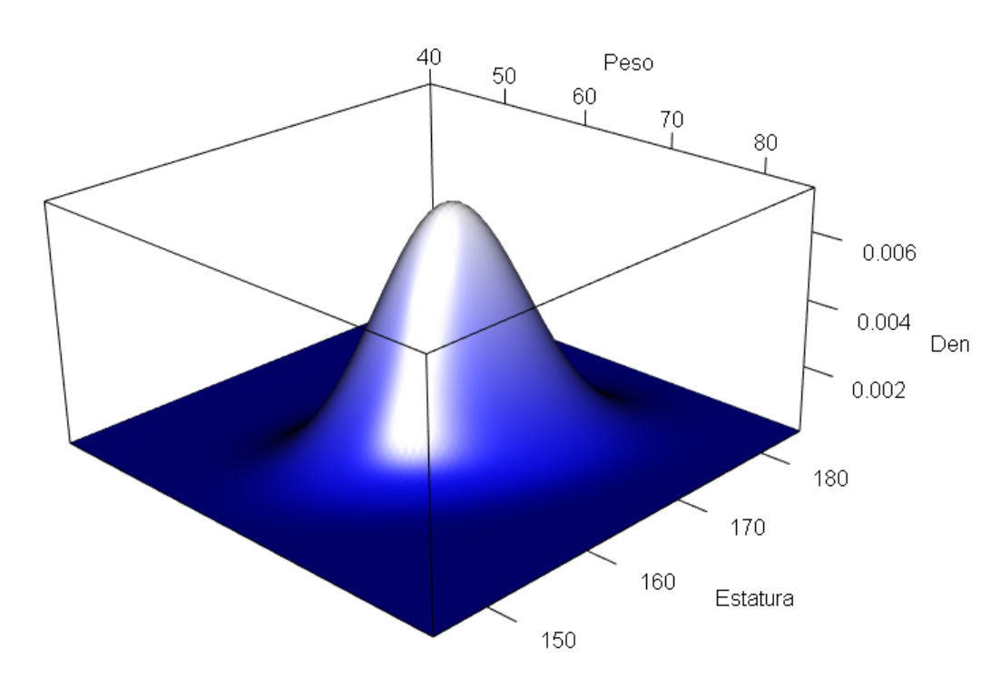

# Distribución normal multivariada {#normalmulti}

En este capítulo se mostrarán aspectos importantes de la distribución normal multivariada.

## Función de densidad

En la densidad Normal $p$-variada, hay dos parámetros, $\boldsymbol{\mu}$ y $\boldsymbol{\Sigma}$. El primero es un vector de columna $p \times 1$ de parámetros de localización y una $p \times p$ matriz de dispersión $\boldsymbol{\Sigma}$. La función de densidad de una normal multivariada es la siguiente:

\begin{equation}
f(\mathbf{x} | \boldsymbol{\mu}, \boldsymbol{\Sigma}) =\frac{1}{\sqrt{(2\pi)^{p}|\boldsymbol{\Sigma}|}} \exp \left( -\frac{1}{2}(\mathbf{x}-\boldsymbol{\mu})^\top\boldsymbol{\Sigma}^{-1}(\mathbf{x}-\boldsymbol{\mu}) \right)
\end{equation}

El símbolo $|\boldsymbol{\Sigma}|$ se refiere al determinante de la matriz $\boldsymbol{\Sigma}$. Esta ecuación asume que $\boldsymbol{\Sigma}$ se puede invertir, y una condición suficiente para la existencia de una inversa es que el determinante no sea $0$. La matriz $\boldsymbol{\Sigma}$ debe ser semidefinida positiva para asegurar que el punto más probable es $\boldsymbol{\mu}$ y que, a medida que $\mathbf{x}$ se aleja de $\boldsymbol{\mu}$ en cualquier dirección, entonces la probabilidad de observar $\mathbf{x}$ disminuye.

### Ejemplo {-}
Dibujar la superficie de una normal bivariada para las variables Peso y Estatura con vector de medias $\boldsymbol{\mu}^\top=(65, 165)$ y matriz de varianzas/covarianzas

$$
\boldsymbol{\Sigma}=
\begin{pmatrix}
20 & 11 \\
11 & 30
\end{pmatrix}
$$

*Solución*

Para crear una superficie de una normal bivariada se puede usar el siguiente código. La función `dmvnorm` del paquete **mvtnorm** [@R-mvtnorm] sirve para obtener la densidad de cada punto.

```{r normmultidensi, fig.cap='Densidad de una normal bivariada.', fig.height=6, fig.width=6}
library(mvtnorm)

mu <- c(65, 165)
Sigma <- matrix(c(20, 11, 
                  11, 30), nrow=2 , byrow = TRUE) 

N <- 50
Peso     <- seq(from=40, to=85, length.out=N)
Estatura <- seq(from=145, to=185, length.out=N)

densidad_curva <- function(x1, x2) dmvnorm(cbind(x1, x2), mean=mu, sigma=Sigma)  

probX <- outer(Peso, Estatura, FUN="densidad_curva")

persp(Peso, Estatura, probX, theta=45, phi=20,
      xlab="Peso",ylab="Estatura", zlab="", ticktype="detailed", nticks=4, col="khaki1")
```


### Ejemplo {-}
Calcular la densidad dos personas $A=(60, 160)$ y $B=(80, 170)$ asumiendo distribución normal bivariada con vector de medias $\boldsymbol{\mu}^\top=(65, 165)$ y matriz de varianzas/covarianzas

$$
\boldsymbol{\Sigma}=
\begin{pmatrix}
20 & 11 \\
11 & 30
\end{pmatrix}
$$

*Solución*

Para calcular los valores de densidad de las dos personas hacemos lo siguiente:

```{r}
library(mvtnorm)

mu <- c(65, 165)
Sigma <- matrix(c(20, 11, 
                  11, 30), nrow=2 , byrow = TRUE) 

dmvnorm(c(60, 160), mean=mu, sigma=Sigma) # Para A
dmvnorm(c(80, 170), mean=mu, sigma=Sigma) # Para B
```

### Ejemplo {-}
Repetir las figuras de la densidad anterior pero usando otros paquetes.

*Solución*

```{r eval=FALSE}
library(rgl)
plot3d(densidad_curva, 
       col = colorRampPalette(c("blue", "white")), 
       xlab = "Peso", ylab = "Estatura", zlab = "Den", 
       xlim = c(40, 85), ylim = c(145, 185),
       aspect = c(1, 1, 0.5))

```

<p align="center">
  
</p>

## Simulando de una normal multivariada

Para simular de una normal multivariada se puede usar la función `mvrnorm` del paquete **MASS** [@R-MASS] o la función `rmvnorm` del paquete **mvtnorm** [@R-mvtnorm].

### Ejemplo {-}

Simular cien observaciones de pesos y estaturas y luego construir un diagrama de dispersión. Asuma que las variables tiene distribución normal bivariada con un vector de medias $\boldsymbol{\mu}^\top=(65, 165)$ y matriz de varianzas/covarianzas

$$
\boldsymbol{\Sigma}=
\begin{pmatrix}
20 & 11 \\
11 & 30
\end{pmatrix}
$$

*Solución*

Para hacer lo solicitado se puede usar el siguiente código.

```{r dispDatosSimul, fig.cap='Diagrama de dispersión para datos simulados de una normal bivariada.', fig.height=6, fig.width=6, message=FALSE}
require(mvtnorm)
mu <- c(65, 165)
Sigma <- matrix(c(20, 11, 
                  11, 30), ncol=2, nrow=2)

n <- 100
datos <- rmvnorm(n=n, mean=mu, sigma=Sigma)

plot(datos, xlab="Peso [kg]", ylab="Estatura [cm]", pch=19, las=1)
points(x=mu[1], y=mu[2], lwd=3, col="tomato", pch=3)
```


### Ejemplo {-}
Usando los datos simulados construya un diagrama de dispersión usando el paquete **plotly**.

*Solución*

```{r simul2plotly, fig.cap='Densidad para los datos simulados de una normal bivariada usando plotly.', message=FALSE}
library(mvtnorm)
library(plotly)

density <- dmvnorm(datos, mean=mu, sigma=Sigma)

plot_ly(x=~datos[,1], y=~datos[,2], z=~density, 
        type = "scatter3d", color=density)
```

### Ejemplo {-}
Usando los datos simulados construya un diagrama de dispersión usando el paquete **scatterplot3d**.

*Solución*

```{r simul3d, fig.cap='Densidad para los datos simulados de una normal bivariada usando scatterplot3d.'}
library(scatterplot3d)

scatterplot3d(x=datos[,1], y=datos[,2], z=density, pch=16, cex.lab=1,
              highlight.3d=TRUE, type="h", xlab="Peso",
              ylab="Estatura", zlab="Densidad")
```

## Calculando probabilidades

La función `pmvnorm` del paquete **mvtnorm** sirve para calcular probabilidades. [Este enlace](https://cran.r-project.org/web/packages/mvtnorm/) lo llevará a la página oficial del paquete donde se puede encontrar una viñeta con información sobre el cálculo de probabilidades.

### Ejemplo {-}
Para el ejemplo de el peso y la estatura calcular la siguiente probabilidad.

$$
P(-\infty < Peso \leq 60, -\infty < Estatura \leq 160)
$$

*Solución*

Para hacer lo solicitado se puede usar el siguiente código.

```{r}
library(mvtnorm)
mu <- c(65, 165)
Sigma <- matrix(c(20, 11, 
                  11, 30), ncol=2, nrow=2)
pmvnorm(mean=mu, sigma=Sigma, 
        lower=c(-Inf, -Inf), upper=c(60, 160))
```
De la salida anterior tenemos que $P(-\infty < Peso \leq 60, -\infty < Estatura \leq 160)=0.1017746$.

## Calculando cuantiles

La función `qmvnorm` del paquete **mvtnorm** sirve para calcular cuantiles.

### Ejemplo {-}
Para el ejemplo de el peso y la estatura calcular la siguiente probabilidad.

```{r}
library(mvtnorm)
mu <- c(65, 165)
Sigma <- matrix(c(20, 11, 
                  11, 30), ncol=2, nrow=2)
qmvnorm(p=0.1017746, mean=mu, sigma=Sigma, 
        tail="lower.tail")
```

## Distancia de Mahalanobis
Si $\mathbf{X}$ se distribuye $N_p(\boldsymbol{\mu}, \boldsymbol{\Sigma})$, la distancia de Mahalanobis se define como

$$
D^2 = (\mathbf{x}-\boldsymbol{\mu})^\top\boldsymbol{\Sigma}^{-1}(\mathbf{x}-\boldsymbol{\mu})
$$

y $D^2 \sim \chi^2_p$.

### Ejemplo {-}
Simular 1000 observaciones de una normal multivariada con vector de medias $\boldsymbol{\mu}^\top=(65, 165)$ y matriz de varianzas/covarianzas

$$
\boldsymbol{\Sigma}=
\begin{pmatrix}
20 & 21 \\
21 & 30
\end{pmatrix}
$$

y explorar la distribución de las distancias $D^2$.

**Solución**

Vamos a simular unos datos con el siguiente código.

```{r maha1, message=FALSE}
require(MASS)
set.seed(1974)
n <- 1000
centro <- c(65, 165)
Sigma <- matrix(c(20, 21,
                  21, 30), ncol=2, nrow=2)
dt <- mvrnorm(n=n, mu=centro, Sigma=Sigma)

# ploting
plot(dt, xlab='Peso (kg)', ylab='Estatura (cm)', pch=20,
     xlim=c(55, 75), ylim=c(140, 190), las=1)
points(x=centro[1], y=centro[2], pch='+', col='tomato', cex=3)
```

Vamos a calcular las distancias $D^2$ pero sin usar la fórmula sino la función `mahalanobis`.

```{r}
d2 <- mahalanobis(x=dt, center=centro, cov=Sigma)
```

Construyamos un qqplot sencillo para explorar la distribución de las distancias $D^2$.

```{r maha2}
qqplot(y=d2, x=qchisq(ppoints(n), df=2), las=1)
abline(a=0, b=1)
```

Mejoremos la figura anterior así:

```{r maha3, message=FALSE}
require(car)
qqPlot(x=d2, distribution='chisq', df=2, las=1)
```

Apliquemos ahora una prueba para estudiar $H_0:$ las $D^2$ tienen distribución $\chi^2_p$ versus $H_1:$ las $D^2$ NO provienen de una distribución $\chi^2_p$.

Primero hagamos un histograma para $D^2$ (con $k=5$ intervalos o breaks) y luego le superponemos la densidad de $\chi^2_p$.

```{r maha4}
hist(d2, breaks=5, freq=FALSE, las=1, ylim=c(0, 0.50))
curve(expr=dchisq(x, df=2), add=TRUE, col="tomato", lwd=2)
```

Para hacer la prueba de hipótesis hacemos lo siguiente:

```{r}
# Goodness of fit test
h <- hist(d2, breaks=5, right=FALSE, plot=FALSE)
h
```

Ahora vamos a calcular las probabilidades esperadas de cada cajón asumiendo que $H_0$ es verdadera, es decir, que las distancias se distribuyen $\chi^2_p$.

```{r}
null_probs <- pchisq(q=h$breaks, df=2) # Prob acumul hasta cada lim_sup del cajon
null_probs <- diff(null_probs)         # Prob esperadas de cada cajon
```

Ahora si aplicamos la prueba.

```{r}
prueba <- chisq.test(x=h$counts, p=null_probs, 
                     rescale.p=TRUE, simulate.p.value=TRUE)
prueba
```

Nota: para más detalles de esta prueba consultar https://www.r-bloggers.com/goodness-of-fit-test-in-r/ 

## EJERCICIOS {-}

1. Simular $n$ observaciones de una normal multivariada con vector de medias $\boldsymbol{\mu}^\top=(65, 165)$ y matriz de varianzas/covarianzas

$$
\boldsymbol{\Sigma}=
\begin{pmatrix}
20 & 21 \\
21 & 30
\end{pmatrix}
$$

y luego aplicar la prueba `chisq.test` para determinar si las distancias $D^2$ siguen una distribución $\chi^2_p$. Repetir esta operación 100 veces para cada uno de los valores $n$ de la siguiente tabla. Use $k=10$ intervalos.

$n$ | Porcentaje de veces que NO se rechaza $H_0$
--- | -------------
10  | 
20  | 
40  | 
80  | 
160 | 


