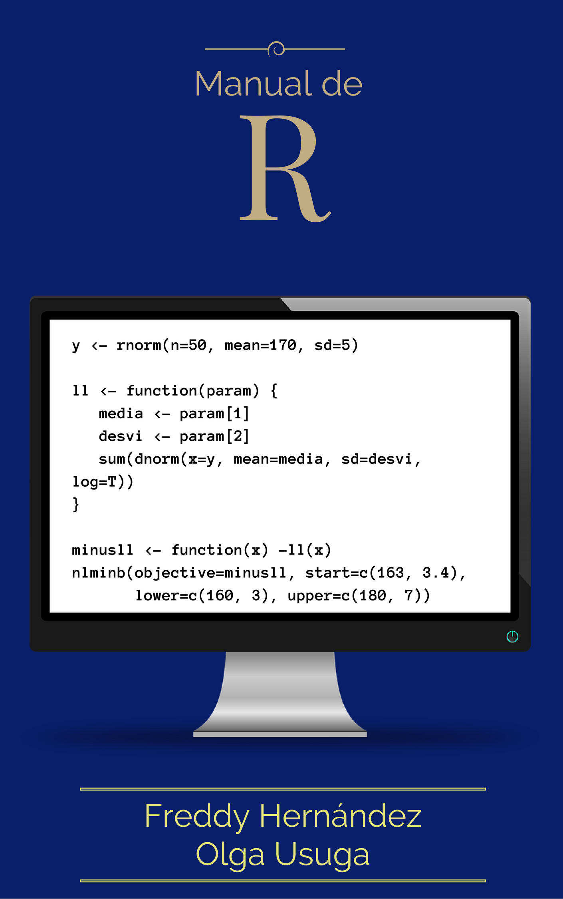

--- 
title: "Manual de R"
author: ["Freddy Hernández", "Olga Usuga"]
date: "`r Sys.Date()`"
site: bookdown::bookdown_site
output: bookdown::gitbook
documentclass: book
bibliography: [book.bib, packages.bib]
biblio-style: apalike
link-citations: yes
cover-image: images/portada.png
github-repo: fhernanb/Manual-de-R
description: "Manual de R para los estudiantes de la Escuela de Estadística de la Universidad Nacional de Colombia."
---

```{r echo=FALSE, message=FALSE}
# lista de paquetes necesarios para compilar el libro
list.of.packages <- c('ggplot2', 'readxl', 'corrplot')
new.packages <- list.of.packages[!(list.of.packages %in% installed.packages()[,"Package"])]
if(length(new.packages)) 
  install.packages(new.packages,
                   repos="https://cloud.r-project.org")
```

```{r include=FALSE}
# automatically create a bib database for R packages
knitr::write_bib(c(.packages(), 
                   'bookdown', 
                   'knitr', 
                   'rmarkdown',
                   'usefultools'), 'packages.bib')
```

# Prefacio {-}

```{r echo=FALSE, out.width="33%", fig.align='center'}

```

Este libro fue creado con la intención de apoyar el aprendizaje del lenguaje de programación R en estudiantes de pregrado, especialización, maestría e investigadores, que necesiten realizar análisis estadísticos. En este libro se explica de una forma sencilla la utilidad de la principales funciones para realizar análisis estadístico.

## Estructura del libro {-}

El libro está estructurado de la siguiente manera.

En el capítulo \@ref(intro) se presenta una breve introducción sobre el lenguaje de programación R; en el capítulo \@ref(objetos) se explican los tipos de objetos más comunes en R; en el capítulo \@ref(estilo) se muestran las normas de estilo sugeridas para escribir código en R; el capítulo \@ref(funbas) presenta las funciones básicas que todo usuario debe conocer para usar con éxito R; el capítulo \@ref(creafun) trata sobre cómo crear funciones; el capítulo \@ref(read) muestra como leer bases de datos desde R; en el capítulo \@ref(tablas) se ilustra la forma para construir tablas de frecuencia; en el capítulo \@ref(central) se muestra como obtener las diversas medidas de tendencial central para variables cuantitativas, el capítulo \@ref(varia) muestra como calcular las medidas de variabilidad, en el capítulo \@ref(posi) se ilustra cómo usar las funciones para obtener medidas de posición; en el capítulo \@ref(correl) se muestra como obtener medidas de correlación entre pares de variables; en los capítulos \@ref(discretas) y \@ref(continuas) se tratan los temas de distribuciones discretas y continuas; en el capítulo \@ref(loglik) se aborda el tema de verosimilitud; en el capítulo \@ref(aproxint) se muestra el tema de aproximación de integrales.

## Información del software y convenciones {-}

Para realizar este libro se usaron los paquetes de R **knitr**\index{knitr} [@xie2015] y **bookdown**\index{bookdown} [@R-bookdown], estos paquetes permiten construir todo el libro desde R y sirven para incluir código que se ejecute de forma automática incluyendo las salidas y gráficos.

En todo el libro se presentarán códigos que el lector puede copiar y pegar en su consola de R para obtener los mismos resultados aquí presentados. Los códigos se destacan en una caja de color beis (o beige) similar a la mostrada a continuación.

```{r, eval=F}
4 + 6
a <- c(1, 5, 6)
5 * a
1:10
```

Los resultados o salidas obtenidos de cualquier código se destacan con dos símbolos de númeral (`##`) al inicio de cada línea o renglón, esto quiere decir que todo lo que inicie con `##` son resultados obtenidos y el usuario __NO__ los debe copiar. Abajo se muestran los resultados obtenidos luego de correr el código anterior.

```{r, echo=F}
4 + 6
a <- c(1, 5, 6)
5 * a
1:10
```

## Bloques informativos {-}
En varias partes del libro usaremos bloques informativos para resaltar algún aspecto importante. Abajo se encuentra un ejemplo de los bloques y su significado.

```{block2, type='rmdnote'}
Nota aclaratoria.
```

```{block2, type='rmdtip'}
Sugerencia.
```

```{block2, type='rmdwarning'}
Advertencia.
```

## Agradecimientos {-}

Agradecemos enormemente a todos los estudiantes, profesores e investigadores que han leído este libro y nos han retroalimentado con comentarios valiosos para mejorar el documento.

```{block2, type='flushright', html.tag='p'}
Freddy Hernández Barajas

Olga Cecilia Usuga Manco
```

